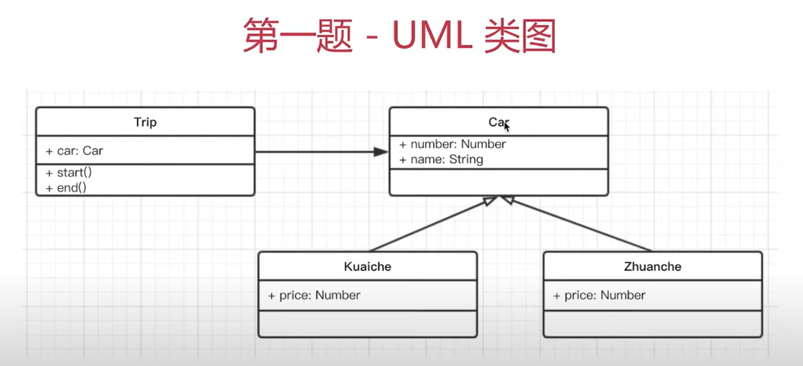
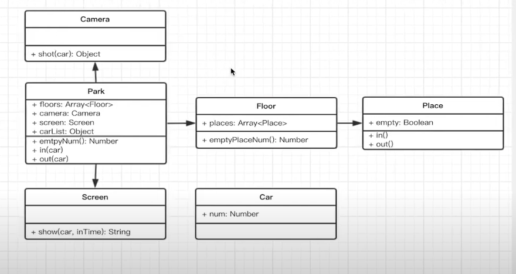

# 设计模式
- 从设计到模式

## 介绍23种设计模式
### 创建型
- 工厂模式（工厂方法模式，抽象工厂模式，建造者模式）
- 单例模式
- 原型模式

### 组合型
- 适配器模式
- 装饰器模式
- 代理模式
- 外观模式
- 桥接模式
- 组合模式
- 享元模式

### 行为型-1
- 策略模式
- 模板方式模式
- 观察者模式
- 迭代器模式
- 职责连模式
- 命令模式

### 行为型-2
- 备忘录模式
- 状态模式
- 访问者模式
- 中介者模式
- 解释器模式

## 如何理解设计模式？
- 介绍和举例（生活中易理解的示例）
- 画UML类图写demo代码
- 结合经典应用场景，讲解该设计模式如何被使用

## 如何学习设计模式？
- 明白每个设计的道理和用意
- 通过经典应用体会它的真正使用场景
- 自己编码时多思考，尽量模仿

## 面试题

### 第一题
- 打车时，可以打专车或者快车。任何车都有车牌号和名称
- 不同车价格不同，快车每公里1元，专车每公里2元
- 行程开始时，显示车辆信息
- 行程结束时，显示打车金额（假定行程就5公里）
- 画出 UML 类图
- 用ES6语法写出该示例

#### UML 类图



#### 代码示例
```javascript
// src/demo1.js
// 父类
class Car {
    constructor(number, name) {
        this.number = number
        this.name = name
    }
}

// 快车
class Kuaiche extends Car {
    constructor(number, name) {
        super(number, name)
        this.price = 1
    }
}

// 专车
class Zhuanche extends Car {
    constructor(number, name) {
        super(number, name)
        this.price = 2
    }
}

// 行程
class Trip {
    constructor(car) {
        this.car = car
    }
    start() {
        console.log(`行程开始，名称：${this.car.name},车牌号：${this.car.number}`)
    }
    end() {
        console.log(`行程结束，价格：${this.car.price * 5}`)
    }
}

let car = new Kuaiche(100, 'Toyota');
let trip = new Trip(car)
trip.start()
trip.end()
```

### 第二题
- 某停车场，分3层，每层100车位
- 每个车位都能监控到车辆的驶入和离开
- 车辆进入前，显示每层的空余车位数量
- 车辆进入时，摄像头可识别车牌号和时间
- 车辆出来时，出口显示器显示车牌号和停车时长

#### UML 类图


#### 代码示例
```javascript
// src/demo2.js
// 车辆
class Car {
    constructor(num) {
        this.num = num
    }
    
}

// 摄像头
class Camera  {
    shot(car) {
        return {
            num: car.num,
            inTime: Date.now()
        }
    }
}

// 出口显示屏
class Screen {
    show(car, inTime) {
        console.log('车牌号：', car.num);
        console.log('停车时间：', Date.now()) - car.inTime;
    }
}

// 停车场
class Park {
    constructor(floors) {
        this.floors = floors || []
        this.camera = new Camera()
        this.screen = new Screen()
        this.carList = {} // 存储摄像头拍摄返回的车辆信息
    }
    in(car) {
        // 通过摄像头获取信息
        const info = this.camera.shot(car)
        // 停到某个停车位
        const i = parseInt(Math.random() * 100 % 100)
        const place = this.floors[0].places[i];
        place.in()
        info.place = place
        // 记录信息
        this.carList[car.num] = info
    }
    out(car) {
        // 获取信息
        const info = this.carList[car.num]
        // 将停车位清空
        const place = info.place
        place.out()
        // 显示时间
        this.screen.show(car, info.inTime)
        // 清空记录
        delete this.carList[car.num]
    }
    emptyNum() {
        return this.floors.map(floor => {
            return `${floor.index} 层还有 ${floor.emptyPlaceNum()} 个空闲车位`
        }).join('\n')
    }
}

// 层
class Floor {
    constructor(index, places) {
        this.index = index
        this.places = places || []
    }
    emptyPlaceNum() {
        let num = 0;
        this.places.forEach(p => {
            if(p.empty) {
                num = num + 1
            }
        });
        return num;
    }
}

// 车位
class Place {
    constructor() {
        this.empty = true
    }
    in() {
        this.empty = false
    }
    out() {
        this.empty = true
    }
}

// 初始化停车场
const floors = []
for(let i = 0; i < 3; i++) {
    const places = [];
    for(let j = 0; j < 100; j++) {
        places[j] = new Place()
    }
    floors[i] = new Floor(i + 1, places)
}
const park = new Park(floors);

// 初始化车辆
const car1 = new Car(100)
const car2 = new Car(200)
const car3 = new Car(300)

console.log('第一辆车进入')
console.log(park.emptyNum())
park.in(car1)
console.log('第二辆车进入')
console.log(park.emptyNum())
park.in(car2)
console.log('第一辆车离开')
console.log(park.emptyNum())
park.out(car1)
console.log('第二辆车离开')
console.log(park.emptyNum())
park.out(car2)

console.log('第三辆车进入')
console.log(park.emptyNum())
park.in(car3)
console.log('第三辆车离开')
console.log(park.emptyNum())
park.out(car3)
```