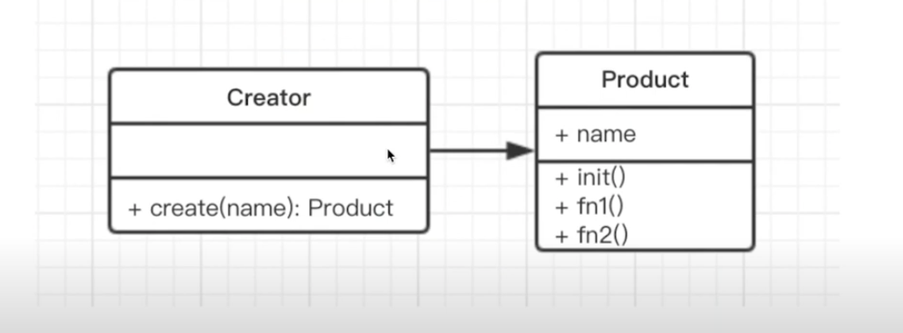

# 工厂模式

## 介绍
- 将 new 操作单独封装
- 遇到 new 时，就要考虑是否使用工厂模式

## 示例
- 你去购买汉堡，直接点餐，取餐，不会自己亲手做
- 商店要 “封装” 做汉堡的工作，做好直接给客户

## 简化的 UML 类图


## 示例
```javascript
class Product {
  constructor(name) {
    this.name = name
  }
  init() {
    console.log('init')
  }
  fn1() {
    console.log('fn1')
  }
  fn2() {
    console.log('fn2')
  }
}

class Creator {
  create() {
    return new Product()
  }
}

const creator = new Creator()
const p = creator.create('p1')
p.init()
p.fn1()
p.fn2()
```

## 场景

### JQuery - $('div')
- $('div') 和 new $('div') 有何区别
- 左边是工厂模式，如果选择后者
- 第一，书写麻烦，JQuery的链式操作将成为噩梦
- 第二，一旦JQuery名字发生变化，将是灾难性的

```javascript
// src/jquery.js
class JQuery {
  constructor(seletor) {
      let slice = Array.prototype.slice;
      let dom = slice.call(document.querySelectorAll(seletor));
      let len = dom ? dom.length : 0;
      for(let i = 0; i < len; i++) {
          this[i] = dom[i]
      }
      this.length = len
      this.seletor = seletor || ''
  }
  append(node) {
      // ...
  }
  addClass(name) {
      // ...
  }
  html(data) {
      // ...
  }
  // 此处省略 N 个 API
}

window.$ = function (seletor) {
  return new JQuery(seletor)
}

// 测试代码
var $p = $('p')
console.log($p)
console.log($p.addClass)
```

### React.createElement
- 将 JSX 转化为 vnode 
```javascript
class Vnode(tag, attrs, children) {
  // ...省略内部代码...
}
React.createElement = function(tag, attrs, children) {
  return new Vnode(tag, attrs, children)
}
```

### vue 异步组件
```javascript
Vue.compoment('async-example', function(resolve, reject){
  setTimeout(function(){
    resolve({
      template: '<div>I am async</div>'
    })
  }, 1000)
})
```

## 设计原则验证
- 构造函数和创建者分离
- 符合开放封闭原则

