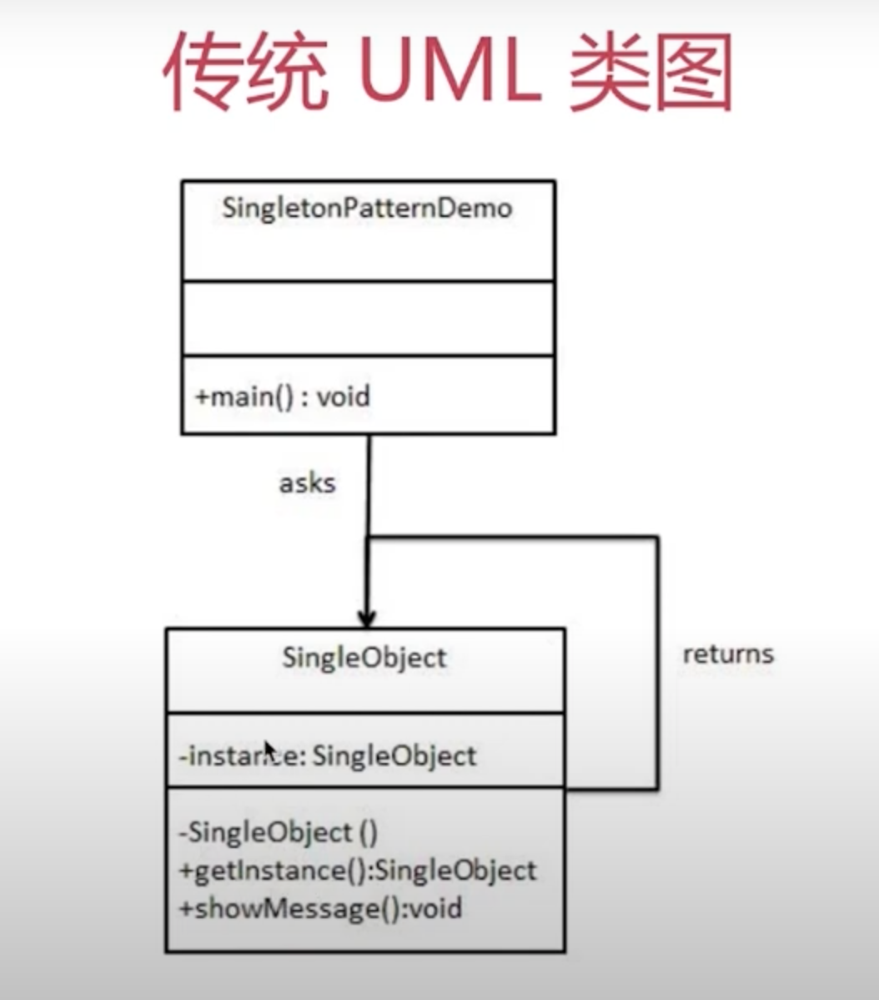

# 单例模式

## 介绍
- 系统中被唯一使用
- 一个类只有一个实例

## 示例
- 登录框
- 购物车

## 简化的 UML 类图


## JS 使用单例模式
```javascript
// src/single.js
class SingleObject {
  login() {
    console.log('login...')
  }
}
SingleObject.getInstance = (function(){
  let instance;
  return function() {
    if(!instance) {
      instance = new SingleObject()
    }
    return instance
  }
})()

// 测试：注意这里只能使用静态函数 getInstance, 不能 new SingleObject(); js 只能自己约束
const obj1 = SingleObject.getInstance()
obj1.login()
const obj2 = SingleObject.getInstance()
obj2.login()
console.log(obj1 === obj2) // 两者必须完全相等
```

## 场景
### JQuery 只有一个 $
```javascript
if(window.JQuery != null) {
  return window.JQuery
}else {
  // 初始化
}
```

### 模拟登录框
```javascript
// src/login.js
class LoginForm {
  constructor() {
    this.state = 'hide'
  }
  show() {
    if(this.state === 'show') {
      console.log('已经显示')
    }else {
      this.state = 'show'
      console.log('登录框显示成功')
    }
  }
  hide() {
    if(this.state === 'hide') {
      console.log('已经隐藏')
    }else {
      this.state = 'hide'
      console.log('登录框隐藏成功')
    }
  }
}

LoginForm.getInstance = (function(){
  let instance;
  return function() {
    if(!instance) {
      instance =  new LoginForm()
    }
    return instance
  }
})()

// 测试
let login1 = LoginForm.getInstance()
login1.show()

let login2 = LoginForm.getInstance()
login2.hide()

console.log('login1 === login2:', login1 === login2)
```
### 其他
- 购物车（与登录框类似）
- vuex 和 redux 的 store

## 设计原则验证
- 符合单一职责原则，只能实例化唯一的对象
- 没法具体开放封闭原则，但是绝对不违反开放封闭原则