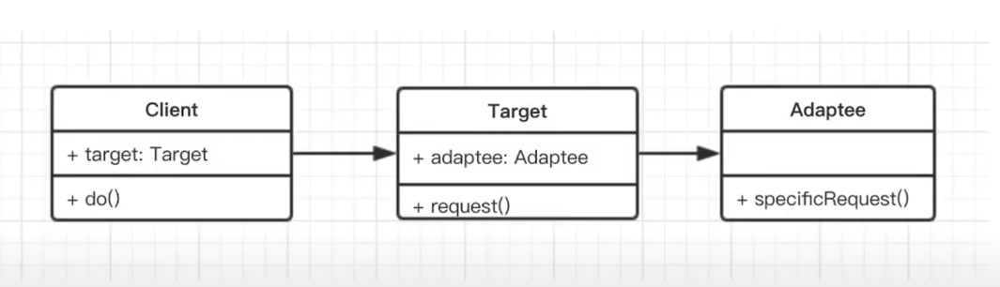

# 适配器模式

## 介绍
- 旧接口格式和使用者不兼容
- 中间加一个适配转换接口

## 简化的 UML 类图


## 代码演示
```javascript
class Adaptee {
    specificRequest() {
        return '德国标准的插头'
    }
}

class Target {
    constructor() {
        this.adaptee = new Adaptee()
    }
    request() {
        let info = this.adaptee.specificRequest()
        return `${info} -> 转换器 -> 中国标准的插头`
    }
}

// 测试
let target = new Target()
target.request()
```

## 场景

### 封装旧接口
```javascript
// 自己封装的 ajax, 使用方式如下
ajax({
    url: '/getData',
    type: 'Post',
    dataType: 'json',
    data: {
        id: '123'
    }
})
// 但因为历史原因，代码中全都是：$.ajax({...})

// 做一层适配器
let $ = {
    ajax: function(options) {
        return ajax(options)
    }
}
```

### vue computed
```javascript
// 顺序：hello； 逆序：olleh
var vm = new Vue({
    el: '#example',
    data: {
        message: 'hello',
    },
    computed: {
        // 计算属性的 getter
        reversedMessage: function() {
            // this 指向 vm 实例
            return this.message.spli('').reverse().join('')
        }
    }
})
```

## 设计原则验证
- 将旧接口和使用者进行分离
- 符合开放封闭原则
