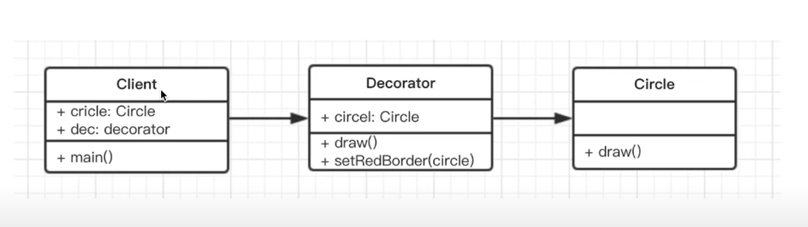

# 装饰器模式

## 介绍
- 为对象添加新功能
- 不改变其原有的结构和功能

## 示例
- 手机壳

## 简化的 UML 类图


## 代码示例
```javascript
class Circle {
    draw() {
        console.log('画一个圆形')
    }
}

class Decorator {
    constructor(circle) {
        this.circle = circle
    }
    draw() {
        this.circle.draw()
        this.setRedBorder(circle)
    }
    setRedBorder(circle) {
        console.log('设置红色边框')
    }
}

// 测试代码
let circle = new Circle()
circle.draw()

let dec = new Decorator(circle)
dec.draw()
```

## 场景

### ES7 装饰器
```javascript
// 一个简单的 Demo
@testDec
class Demo {

}

function testDec(target) {
    target.isDec = true
}
console.log(Demo.isDec)
```

- 配置环境
```javascript
// 两种不同版本的安装 
// Babel >= 7.x
npm install babel-plugin-transform-decorators-legacy --save-dev
// .babelrc
{
  "plugins": [
    ["@babel/plugin-proposal-decorators", { "legacy": true }],
  ]
}

// Babel@6.x
npm install --save-dev babel-plugin-transform-decorators-legacy
{
    "plugins": ["transform-decorators-legacy"]
}
```

- 装饰类
```javascript
// 装饰器的原理
@decorator
class A {}

// 等同于
class A {}
A = decorator(A) || A;


// 加参数
@testDec(false)
class Demo {

}
function testDec(isDec) {
    return function (target) {
        target.isDec = isDec
    }
}
console.log(Demo.isDec)

// mixin 示例
function mixins(...list) {
    return function (target) {
        Object.assign(target.prototype, ...list)
    }
}

const Foo = {
    foo() {
        console.log('foo')
    }
}

@mixins(Foo)
class MyClass {

}

let obj = new MyClass()
obj.foo()

```

- 装饰方法
```javascript
@readonly

// 装饰方法 - 例1
function readonly(target, name, descriptor) {
    // descriptor 属性描述对象 (Object.defineProperty 中会用到)， 原来的值如下
    // {
    //     value: specifiedFunction,
    //     enumerable: false,
    //     configurable: true,
    //     writable: true
    // }

    descriptor.writable = false;
    return descriptor
}

class Person {
    constructor() {
        this.first = 'A'
        this.last = 'B'
    }

    @readonly
    name() {
        return `${this.first} ${this.last}`
    }
}

let p = new Person()
console.log(p.name())
p.name = function() {
    console.log('100')
}


@log

// 装饰方法 - 例2
function log(target, name, descriptor) {
    var oldValue = descriptor.value;

    descriptor.value = function() {
        console.log(`Calling ${name} with`, arguments);
        return oldValue.apply(this, arguments)
    }
    
    return descriptor;
}


class Math {
    // 装饰方法
    @log
    add(a, b) {
        return a + b;
    }
}

const math = new Math();
const result = math.add(2, 4);
console.log('result', result);

```
### core-decorators(第三方库)
[npm](https://www.npmjs.com/package/core-decorators)
```javascript
// 安装
npm install core-decorators --save

import { readonly } from 'core-decorators';
 
class Meal {
  @readonly
  entree = 'steak';
}
 
var dinner = new Meal();
dinner.entree = 'salmon';
```

## 设计原则验证
- 将现有对象和装饰器进行分离，两者独立存在
- 符合开放封闭原则
