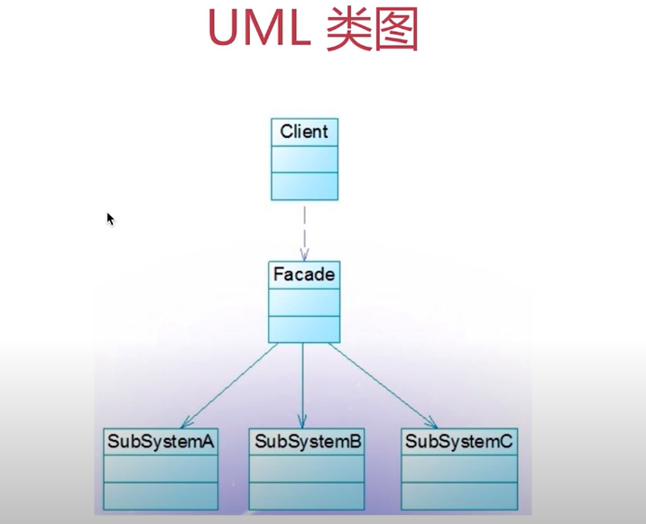

# 外观模式

## 介绍
- 为子系统中的一组接口提供了一个高层接口
- 使用者使用这个高层接口

## 示例
- 去医院看病，接待员去挂号、门诊、交费、取药

## UML 类图


## 场景
```javascript
function bindEvent(elem, type, selector, fn) {
    if(fn == null) {
        fn = selector
        selector = null
    }
    // ***
}
// 调用
bindEvent(elem, 'click', '#div1', fn)
bindEvent(elem, 'click', fn)
```

## 设计原则验证
- 不符合单一职责原则和开放封闭原则，因此谨慎使用，不可滥用
