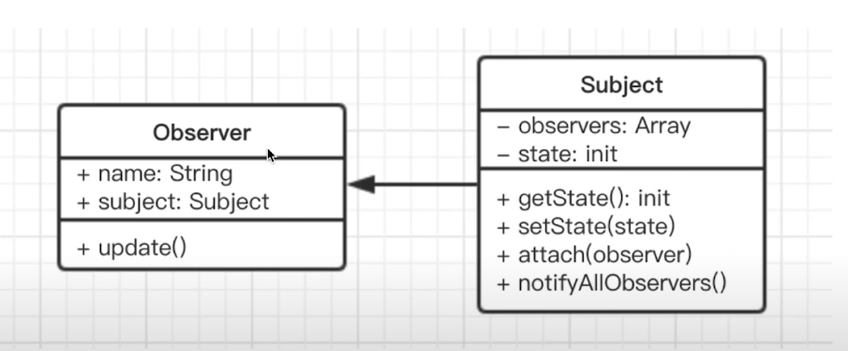

# 观察者模式（前端应用最多）

## 介绍
- 发布 & 订阅
- 一对多

## 示例
- 点咖啡，点好之后坐等被叫


## 简化的 UML 类图


## 示例代码
```javascript
// 主题，保存状态，状态变化后触发所有观察者对象
class Subject {
    constructor() {
        this.state = 0;
        this.observers = [];
    }
    getState() {
        return this.state;
    }
    setState(state) {
        this.state = state
        this.notifyAllObservers()
    }
    notifyAllObservers() {
        this.observers.forEach(observer => {
            observer.update()
        })
    }
    attach(observer) {
        this.observers.push(observer)
    }
}

// 观察者
class Observer {
    constructor(name, subject) {
        this.name = name
        this.subject = subject
        this.subject.attach(this)
    }
    update() {
        console.log(`${this.name} update, state: ${this.subject.getState()}`)
    }
}

// 测试
let s = new Subject()
let o1 = new Observer('o1', s)
let o2 = new Observer('o2', s)
let o3 = new Observer('o3', s)

s.setState(1)
s.setState(2)
s.setState(3)
```

## 场景
### 网页事件绑定
```javascript
<button id="bt1">btn</button>

$('#btn1').click(function (){
    console.log(1)
})
$('#btn1').click(function (){
    console.log(2)
})
$('#btn1').click(function (){
    console.log(3)
})
```

### Promise
```javascript
function loadImg(src) {
    var promise = new Promise(function (resolve, reject) {
        var img = document.createElement('img')
        img.onload = function() {
            resolve(img)
        }
        img.onerror = function() {
            reject('图片加载失败')
        }
        img.src = src
    })
    return promise
}

let src = 'https://p26-passport.byteacctimg.com/img/user-avatar/4d0a1fbdc3d957f62ecde912c80082b0~300x300.image'
let result = loadImg(src);

result.then(function(img){
    // part 1
    console.log(`width: ${img.width}`)
    return img
}).then(function(img){
    // part 2
    console.log(`height: ${img.height}`)
}).catch(function(err){
    console.log(err)
})
```

### JQuery callbacks
```javascript
// src/test.html
// 自定义事件，自定义回调
var callbacks = $.Callbacks()
callbacks.add(function (info) {
    console.log('fn1', info)
})
callbacks.add(function (info) {
    console.log('fn2', info)
})
callbacks.add(function (info) {
    console.log('fn2', info)
})
callbacks.fire('gogogo')
```

### nodejs 自定义事件
```bash
cd nodejs
node test1.js
```

```javascript
// nodejs/test1.js
const EventEmitter = require('events').EventEmitter
const emitter1 = new EventEmitter()
emitter1.on('some', ()=> {
    // 监听 some 事件
    console.log('some event is occured 1')
})
emitter1.on('some', ()=> {
    // 监听 some 事件
    console.log('some event is occured 2')
})
emitter1.on('some1', (v)=> {
    // 监听 some1 事件
    console.log('some1 event is occured ', v)
})
emitter1.emit('some')
emitter1.emit('some1', 0) // 加参数


// nodejs/test2.js
const EventEmitter = require('events').EventEmitter
// 任何构造函数都可以继承 EventEmitter 的方法 on emit
class Dog extends EventEmitter {
    constructor(name) {
        super()
        this.name = name
    }
}
var simon = new Dog('simon')
simon.on('bark', function() {
    console.log(this.name, ' barked')
})
setInterval(()=> {
    simon.emit('bark')
},500)


// nodejs/test3.js
// Stream 用到了自定义事件
var fs = require('fs')
var readStream = fs.createReadStream('./data/file1.txt')
var length = 0
readStream.on('data', function(chunk) {
    length += chunk.toString().length
})
readStream.on('end', function() {
    console.log(length)
})


// nodejs/test4.js
// readline 用到了自定义事件
var readline = require('readline')
var fs = require('fs')
var rl = readline.createInterface({
    input: fs.createReadStream('./data/file1.txt')
})
var lineNum = 0
rl.on('line', function(line){
    lineNum++
})
rl.on('close', function(){
    console.log('lineNum', lineNum)
})
```

### 其他场景
- nodejs 中：处理 http 请求；多进程通讯
- vue 和 React 组件生命周期触发
- vue watch

## 设计原则验证
- 主题和观察者分离，不是主动触发而是被动监听，二者解耦
- 符合开放封闭原则