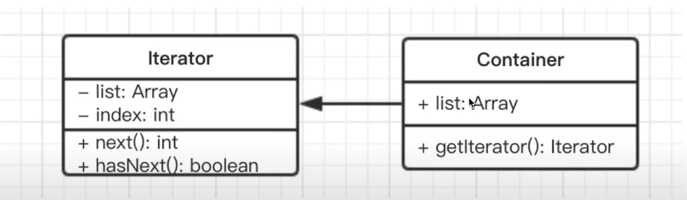

# 迭代器模式

## 介绍
- 顺序访问一个集合
- 使用者无需知道集合的内部结构（封装）

## 示例
```html
<p>jquery each</p>
<p>jquery each</p>
<p>jquery each</p>
```

```javascript
var arr = [1, 2, 3]
var nodeList = document.getElementsByTagName('p')
var $p = $('p')

// 需要对这三个变量进行遍历，需要写三个遍历方法
// 第一
arr.forEach(function (item){
    console.log(item)
})
// 第二
var i, length = nodeList.length
for(i = 0; i < length; i++) {
    console.log(nodeList[i])
}
// 第三
$p.each(function (key, p) {
    console.log(key, p)
})

// 编写公用的遍历方法
function each(data) {
    var $data = $(data) // 生成迭代器
    $data.each(function (key, val) {
        console.log(key, val)
    })
}
each(arr)
each(nodeList)
each($p)
```

## 简化的 UML 类图


## 代码演示
```javascript
class Iterator {
    constructor(container) {
        this.list = container.list
        this.index = 0
    }
    next() {
         if(this.hasNext()) {
            return this.list[this.index++]
         }
         return null
    }
    hasNext() {
        if(this.index >= this.list.length) {
            return false
        }
        return true
    }
}

class Container {
    constructor(list) {
        this.list = list
    }
    // 生成遍历器
    getIterator() {
        return new Iterator(this)
    }
}

var arr = [1, 2, 3, 4, 5]
let container = new Container(arr)
let iterator = container.getIterator()
while(iterator.hasNext()) {
    console.log(iterator.next())
}
```

## 场景

### JQuery Each
```javascript
// 编写公用的遍历方法
function each(data) {
    var $data = $(data) // 生成迭代器
    $data.each(function (key, val) {
        console.log(key, val)
    })
}
each(arr)
each(nodeList)
each($p)
```

### ES6 Iterator

#### ES6 Iterator  为何存在
- ES6 语法中，有序集合的数据类型已经有很多
- Array Map Set String TypedArray arguments NodeList
- 需要有一个统一的遍历接口来遍历所有数据类型
- (注意，object不是有序集合，可以用Map代替)

#### ES6 Iterator 是什么
- 以上数据类型，都有[Symbol.iterator]属性
- 属性值是函数，执行函数返回一个迭代器
- 这个迭代器就有 next 方法可顺序迭代子元素
- 可运行 Array.prototype[Symbol.iterator] 来测试

#### ES Iterator 示例
```javascript
function each(data) {
    // 生成遍历器
    let iterator = data[Symbol.iterator]()

    let item = {done:false}
    while(!item.done) {
        item = iterator.next()
        if(!item.done) {
            console.log(item.value)
        }
    }
}

// `Symbol.iterator` 并不是人人都知道
// 也不是每个人都需要封装一个 each 方法
// 因此有了 `for...of` 语法
function each(data) {
    for(let item of data) {
        cosnole.log(item)
    }
}
each(arr)
each(nodeList)
```

#### ES Iterator 与 Generator(生成器)
- Iterator 的价值不限于上述几个类型的遍历
- 还有 Generator 函数的使用
- 即只要返回的数据符合 Iterator 接口的要求

```javascript
function* helloWorldGenerator() {
    yield 'hello';
    yield 'world';
    return 'ending';
}
var hw = helloWorldGenerator()
hw[Symbol.iterator]
// ƒ [Symbol.iterator]() { [native code] }
// 可以看到， Generator 函数返回的结果，也实现了 Iterator 的接口
```

补充： Generator 函数 目前应用不广泛了，被 async awit 代替

## 设计原则验证
- 迭代器对象和目标对象分离
- 迭代器将使用者与目标对象隔离开
- 符合开放封闭原则