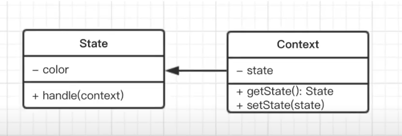

# 状态模式

## 介绍
- 一个对象有状态变化
- 每次状态变化都会触发一个逻辑
- 不能总是用 if...else 来控制

## 示例
- 交通信号灯不同颜色的变化

## 简化的 UML 类图


## 代码演示
```javascript
// src/state.js

// 状态（红灯、绿灯、黄灯）
class State {
    constructor(color) {
        this.color = color
    }
    handle(context) {
        console.log(`trun to ${this.color} light`)
        context.setState(this)
    }
}

// 主体
class Context {
    constructor() {
        this.state = null
    }
    getState() {
        return this.state
    }
    setState(state) {
        this.state = state
    }
}

// test
let context = new Context()

let green = new State('green')
let yellow = new State('yellow')
let red = new State('red')

// 绿灯亮了
green.handle(context)
console.log(context.getState())

// 黄灯亮了
yellow.handle(context)
console.log(context.getState())

// 红灯亮了
red.handle(context)
console.log(context.getState())

```

## 场景

### 有限状态机
- 有限个状态、以及在这些状态之间的变化
- 如交通信号灯
- 使用开源lib : [javascript-state-machine](https://github.com/jakesgordon/javascript-state-machine)

#### 有限状态机- “收藏” 和 “取消”
```
src/state-machin.js
```

### 写一个简单的 Promise
- Promise 就是一个有限状态机
- Promise 三种状态： pending fullfilled rejected
- pending -> fullfilled 或者 pending -> rejected


