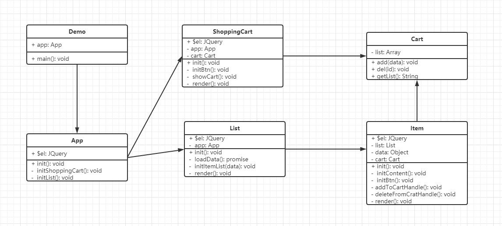

# JQuery做一个模拟购物车的示例

## 主要功能
- 显示购物车列表、加入购物车、从购物车删除

## 用到的设计模式
- 工厂模式 单例模式
- 装饰器模式 观察者模式
- 状态模式 模板方法模式 代理模式

## UML 类图


## 前置服务器环境
```
cd src/demo
http-server -p 8880
```

## 源码目录
```
design-pattern-test/src/demo
```

## 总结用到的设计模式
- 工厂模式：$('xxx')，创建商品
- 单例模式：购物车
- 装饰器模式：打点统计
- 观察者模式：网页事件，Promise
- 状态模式：添加到购物车 & 从购物车删除
- 模板方法模式：渲染有统一的方法，内部包含了各模块渲染
- 代理模式：打折商品信息处理
